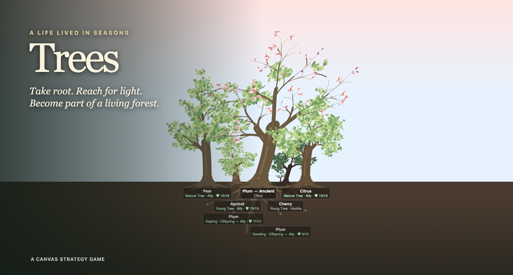
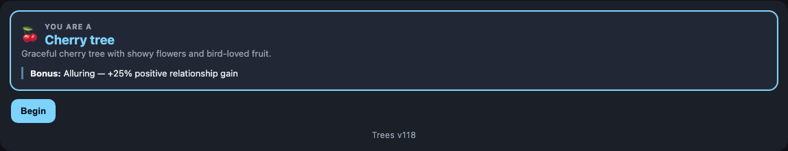
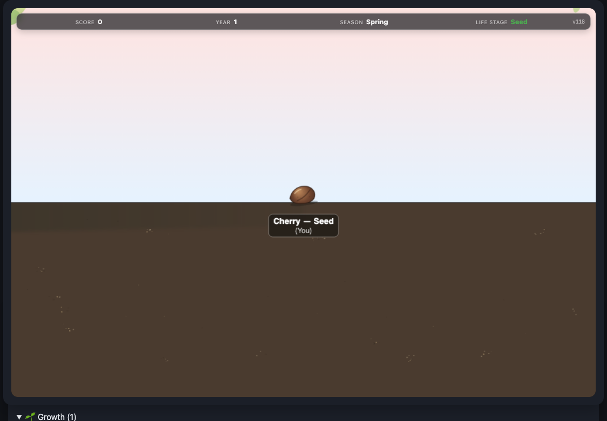
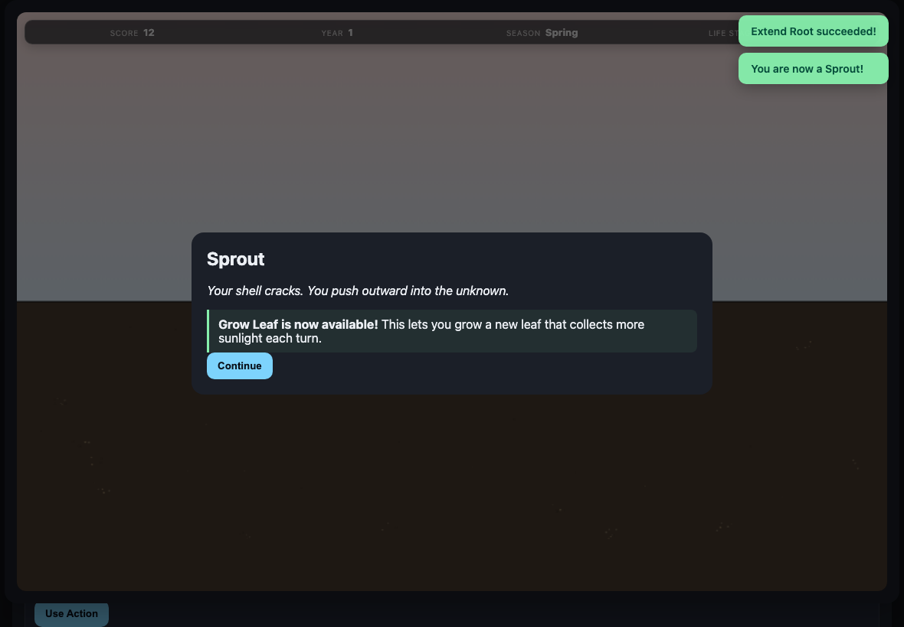

<p align="center">
  
</p>

<p align="center">
  <strong>A browser strategy game about living an entire life as a fruit tree.</strong><br>
  Take root, gather what the seasons offer, contend with your neighbors, raise offspring, and leave a grove behind.
</p>

<p align="center">
  <a href="https://fidgetbot.github.io/trees/"><strong>Play Trees</strong></a>
  ·
  <a href="SPEC.md">Read the game specification</a>
</p>

## You are the tree

*Trees* is a slow-burn survival and ecology game played across seasons and years. You do not command a forest from above. You begin underground as a single seed and make the biological choices of one growing tree: where to put down roots, when to open new leaves, how much to invest in height or resilience, which neighbors to trust, and what part of yourself to risk when trouble arrives.

The forest remembers those choices. A tree you help while it is young may one day shelter the grove. An ally you neglect may be less generous when you need water. A rival can crowd your canopy or compete belowground. Your own shade can slow an offspring growing on the wrong side of your trunk. Trees die, weather into stumps, and eventually make room for seedlings.

The goal is not simply to become large. It is to survive long enough—and care widely enough—that your life changes what can grow after you.

## How a life unfolds

1. **Gather** sunlight, water, and nutrients according to your structure, the season, nearby trees, and current threats.
2. **Grow** leaves, roots, branches, bark, height, defenses, flowers, and fruit by spending stored resources.
3. **Relate** to neighboring trees through fungal connections, aid, rivalry, canopy pressure, and remembered reciprocity.
4. **Endure** drought, storms, browsing animals, disease, insects, and increasing human attention.
5. **Reproduce** and nurture individual offspring with their own health, growth, crises, and place in the grove.
6. **Leave a legacy** by reaching Ancient and helping two allied or child trees mature into a protected ecosystem.

Reaching Ancient is a milestone, not a stopping point. You may continue playing after the grove earns protection.

## From seed to forest

Each run casts you as one of six fruiting species. All follow the same ecological rules, but each brings a distinct strength: Plum grows quickly, Apricot flowers efficiently, Pear keeps more fruit, Citrus attracts pollinators, Cherry forms relationships readily, and Peach is quietly resilient.

<p align="center">
  
</p>

The opening is deliberately small. Your first meaningful decision is to extend a root; only then can the seed begin drawing from the soil. New abilities arrive with life stages and time spent growing, so the game expands from one underground action into a web of structure, diplomacy, defense, reproduction, and long-term stewardship.

<table>
  <tr>
    <td width="50%"></td>
    <td width="50%"></td>
  </tr>
  <tr>
    <td align="center"><em>Every run begins with one seed and one possible action.</em></td>
    <td align="center"><em>Growth changes both your form and your choices.</em></td>
  </tr>
</table>

## What is simulated

- **Four distinct seasons** with changing light, water, dormancy, weather, reproduction, and event pools.
- **Seven life stages** from Seed to Ancient, each visible in the Canvas art and tied to real progression requirements.
- **Persistent structure:** roots, taproots, trunk strength, height, branches, foliage, canopy spread, bark, thorns, and toxic leaves all have mechanical and visual consequences.
- **A living neighborhood:** nearby trees retain their species, size, health, relationship, crises, competition, and history with you.
- **Directional canopy competition:** growing taller can let you shade a neighbor, but taller rivals can crowd you in return.
- **Mycorrhizal cooperation:** allied trees exchange water and minerals and can help prime realistic chemical defenses.
- **Individual offspring:** children can be inspected, nurtured, shaded, injured, helped, and eventually counted toward the future of the grove.
- **Forest succession:** dead trees become gray snags, then stumps, then sites for new random seedlings.
- **A reactive illustrated map:** seasons, snow, fruit, blossoms, wounds, defenses, people, roots, fungal links, shade, and death all appear in the same persistent grove.

The game aims for grounded tree behavior. Its drama comes from physiology, scarcity, time, and interdependence rather than animated or magical trees.

## Playing

*Trees* works in a modern browser on desktop and mobile. Select a tree or visitor to see its actions in the floating dock, then end the turn when ready—no page scrolling. All actions and Info open detail sheets. Use Explore to open the larger grove; drag to pan and use pinch, the zoom controls, or Ctrl/⌘-scroll to inspect the forest.

**Play the current build:** https://fidgetbot.github.io/trees/

## Running locally

The game is plain HTML, CSS, JavaScript modules, and Canvas—there is no build step.

```sh
git clone https://github.com/fidgetbot/trees.git
cd trees
python3 -m http.server 8000
```

Then open <http://localhost:8000>.

### Tests and simulation

Run the rule and regression suite:

```sh
node --test tests/*.test.mjs
```

Run a deterministic headless balance simulation:

```sh
node sim/run.js --turns 96 --games 8 --seed 20 --species Plum
```

See [sim/README.md](sim/README.md) for the simulation output and available flags.

## Project map

```text
core/        Shared game rules, state transitions, events, growth, and diplomacy
ui/          Canvas rendering and browser presentation
tests/       Node-based gameplay and rendering regressions
sim/         Seeded headless simulation and balance reporting
index.html   Browser shell
main.js      Browser orchestration
SPEC.md      Current design and architecture
```

The browser and simulator share the same core rules. Player-facing mechanics belong in `core/`; the UI adapts those rules into choices, prose, status, and the evolving grove.

## Design direction

The complete current design lives in [SPEC.md](SPEC.md). The guiding principles are:

- make growth legible in both rules and art;
- make relationships persistent rather than disposable bonuses;
- let seasons alter plans without making outcomes arbitrary;
- keep player-facing language botanical, direct, and grounded;
- treat survival, reproduction, and stewardship as overlapping goals;
- show the consequences of a long life in the forest itself.

---

<p align="center"><em>“The creation of a thousand forests is in one acorn.” — Ralph Waldo Emerson</em></p>
